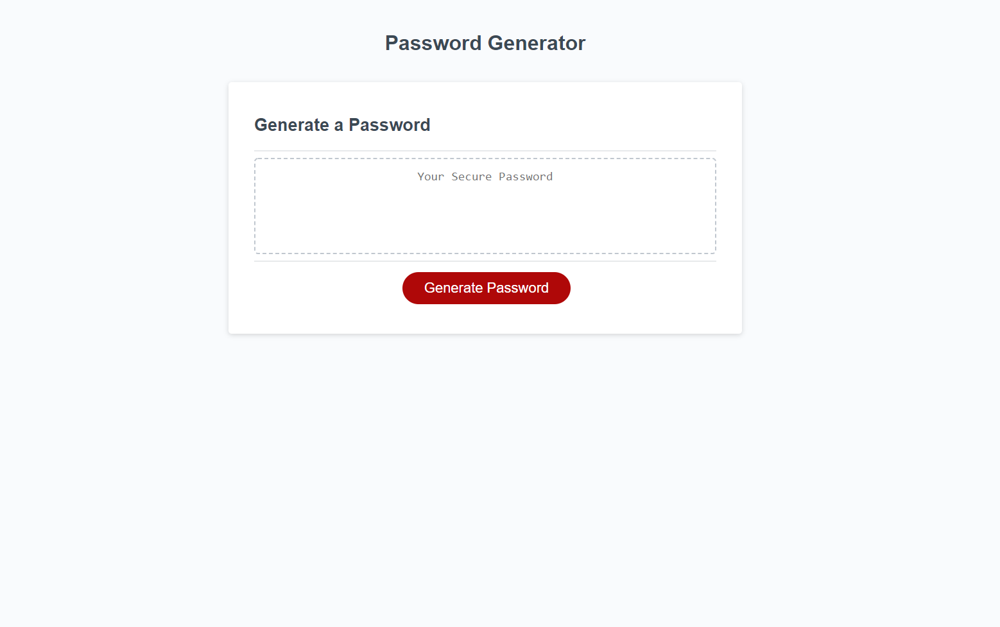

# Password Generator

## Description
The goal of this project was to create an application that enables users to generate random passwords based on the criteria that they have selected. This application will run in the browser and has a responsive user interface that adapts to multiple screen sizes.

## Table of Contents
- [Technologies](#technologies)
- [Preview](#preview)
- [Launch](#launch)

## Technologies
- HTML
- CSS
- JavaScript
## Preview

## Launch
[Github Pages](https://negronmarc.github.io/passwordgenerator/)
